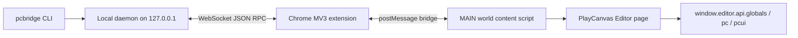

# PlayCanvas Agent Bridge CLI - Project Brief

Date: 2026-06-25

This project should build a CLI-first automation bridge for controlling an already-open PlayCanvas Editor scene from local AI coding agents such as Codex.

The important product decision: **do not make MCP the core interface**. The core should be a normal command-line tool plus a local daemon and Chrome extension. MCP can be added later as a thin adapter that shells out to the CLI, but the main implementation must be usable without any MCP client.

## Target Outcome

Build an installable package that exposes a `pcbridge` command:

```bash
pcbridge doctor
pcbridge daemon start
pcbridge daemon status
pcbridge targets
pcbridge eval --target current --code "return location.href"
pcbridge eval --target scene:<sceneId> --file /tmp/task.js
pcbridge entity list --target current
pcbridge entity create --target current --json ./entity.json
pcbridge entity patch --target current --id <resource_id> --set position=[0,1,0]
pcbridge asset list --target current --type script
pcbridge script set-text --target current --asset-id <id> --file ./pc_script/foo.js
pcbridge viewport capture --target current --out /tmp/viewport.webp
```

The package should include a Chrome Manifest V3 extension. The extension connects PlayCanvas Editor pages to the local daemon and gives the daemon access to the real page context where `window.editor`, `pc`, and `pcui` exist.

## Why This Exists

We already tested several approaches:

- Chrome automation or generic browser evaluation may not expose the real PlayCanvas `window.editor`.
- DevTools Console automation is brittle because the console can be in the wrong execution context and mouse/keyboard automation can type code into the wrong place.
- Chrome AppleScript JavaScript execution requires a user setting and is not reliable enough as a foundation.
- A generic Tampermonkey localhost bridge worked: it executed arbitrary JavaScript inside the PlayCanvas Editor page through `unsafeWindow.editor`.
- The Tampermonkey approach is flexible but not ideal as a product: install/update is manual, background tab behavior can be throttled, and the HTTP polling queue is a little primitive.
- The official PlayCanvas MCP project validates a better transport shape: Chrome extension in the page context plus WebSocket to a local server.

This project should combine the best parts:

- Keep the **generic eval capability** from the Tampermonkey bridge.
- Use a **Chrome extension + WebSocket daemon** like the official PlayCanvas MCP server.
- Expose a **CLI-first command surface** that is easy for Codex and humans to run.
- Add structured commands over time so LLMs do not need to write raw Editor API JavaScript for every common task.

## Non-Goals

- Do not build an MCP server as the first-class interface.
- Do not require DevTools to be open.
- Do not use mouse or keyboard automation for normal operations.
- Do not build task-specific browser methods such as `createBox` into the extension.
- Do not return raw PlayCanvas `Entity`, `Asset`, `editor`, `app`, or root objects in CLI JSON.
- Do not assume one active foreground PlayCanvas tab. The CLI should be able to target background PlayCanvas Editor tabs when Chrome has not discarded or suspended them.

## Architecture



### 1. CLI

The CLI is the primary user and agent interface. It should be deterministic, scriptable, and JSON-friendly.

Recommended package shape:

```text
package.json
src/
  cli.ts
  daemon/
    server.ts
    target-registry.ts
    protocol.ts
  commands/
    doctor.ts
    targets.ts
    eval.ts
    entity.ts
    asset.ts
    script.ts
    scene.ts
    viewport.ts
extension/
  manifest.json
  main.js
  isolated.js
  service-worker.js
  popup.html
  popup.js
```

Prefer TypeScript for the CLI and daemon. Use a simple CLI library only if it clearly helps. Avoid over-engineering the first version.

### 2. Local Daemon

The daemon should:

- listen only on `127.0.0.1`;
- own the WebSocket server used by the Chrome extension;
- track every connected PlayCanvas Editor tab as a target;
- route CLI requests to the selected target;
- enforce request timeouts;
- return compact JSON envelopes;
- generate or load a local session token for extension handshake;
- expose a small local HTTP or IPC API for CLI commands.

Default port can be `17329` to preserve continuity with the current Tampermonkey bridge. If the port is busy, the CLI should report it clearly.

### 3. Chrome Extension

The extension should replace Tampermonkey as the durable browser-side bridge.

Required behavior:

- Manifest V3.
- Match `https://playcanvas.com/editor*` and `http://playcanvas.com/editor*`.
- Use a `MAIN` world content script to access the real page `window.editor`.
- Use an isolated/content/service-worker layer when needed to talk to extension APIs.
- Connect automatically to the local daemon when a PlayCanvas Editor page loads.
- Reconnect automatically if the daemon restarts.
- Register metadata for each Editor tab: URL, tab id when available, project id, scene id, branch id, page title, readiness, last seen time.
- Support background PlayCanvas tabs as long as Chrome has not discarded the page.

The extension may include a popup for diagnostics, but normal CLI operation should not require opening the popup or clicking `CONNECT`.

### 4. Page Execution Layer

The page execution layer is intentionally generic. It should register methods like:

- `bridge:ping`
- `bridge:describeTarget`
- `bridge:eval`
- `bridge:captureViewport`

Common domain operations can be implemented either:

- in the CLI as snippets sent through `bridge:eval`; or
- as page-side generic methods if they are stable and broadly useful.

Keep page-side code small and generic. The extension should not become a growing pile of one-off commands.

## Protocol

Use JSON messages with request ids.

Daemon to extension:

```json
{
  "id": "req_123",
  "type": "request",
  "method": "bridge:eval",
  "target": "tab:123",
  "params": {
    "code": "return { href: location.href, hasEditor: !!editor };",
    "timeoutMs": 15000
  }
}
```

Extension to daemon:

```json
{
  "id": "req_123",
  "type": "response",
  "ok": true,
  "data": {
    "href": "https://playcanvas.com/editor/scene/..."
  },
  "meta": {
    "target": "tab:123",
    "durationMs": 42
  }
}
```

All CLI commands should print a consistent envelope:

```json
{
  "ok": true,
  "data": {},
  "meta": {
    "target": "tab:123",
    "affected": 1,
    "hasMore": false
  }
}
```

Error shape:

```json
{
  "ok": false,
  "error": {
    "code": "TARGET_NOT_READY",
    "message": "PlayCanvas Editor API is not ready in the selected tab."
  },
  "meta": {
    "target": "tab:123"
  }
}
```

## Target Selection

The daemon should support multiple open Editor tabs. CLI target selection should be explicit but ergonomic:

```bash
pcbridge targets
pcbridge eval --target current --code "return location.href"
pcbridge eval --target tab:123 --code "return location.href"
pcbridge eval --target scene:987654 --code "return location.href"
pcbridge eval --target project:123456 --code "return location.href"
```

`current` may mean the most recently active/seen ready target. If multiple matches exist, return an ambiguity error and show candidate targets.

## First Milestone

Implement only the foundation:

1. `pcbridge doctor`
   - verifies Node version;
   - verifies daemon reachability;
   - verifies extension install path exists if known;
   - prints next actions.

2. `pcbridge daemon start`
   - starts WebSocket daemon on `127.0.0.1:17329`;
   - prints JSON or readable logs;
   - accepts extension connections.

3. Chrome extension
   - injects into PlayCanvas Editor pages;
   - enters `MAIN` world;
   - detects `window.editor`;
   - registers target metadata with daemon;
   - executes `bridge:eval`.

4. `pcbridge targets`
   - lists connected ready and not-ready PlayCanvas tabs.

5. `pcbridge eval`
   - supports `--code`, `--file`, and `--stdin`;
   - runs code in an async function with bindings:

```js
editor;
pc;
pcui;
window;
document;
command;
serialize;
```

6. `pcbridge install-extension`
   - copies or exposes the bundled extension directory;
   - opens or prints `chrome://extensions`;
   - prints the exact unpacked extension path the user should load.

## Later Structured Commands

After generic transport works, add LLM-friendly structured commands.

Entity commands:

```bash
pcbridge entity list --name Player --component render --limit 50
pcbridge entity get --id <resource_id>
pcbridge entity create --json ./entity.json
pcbridge entity patch --id <resource_id> --set name=Player --set position=[0,1,0]
pcbridge entity delete --id <resource_id>
pcbridge entity duplicate --id <resource_id>
pcbridge entity reparent --id <resource_id> --parent <resource_id> --preserve-transform
pcbridge entity add-component --id <resource_id> --component render --json ./render.json
pcbridge entity remove-component --id <resource_id> --component render
```

Asset and script commands:

```bash
pcbridge asset list --type script --name controller
pcbridge asset get --id <asset_id>
pcbridge asset create-script --name foo.js --file ./foo.js
pcbridge script set-text --asset-id <asset_id> --file ./foo.js
pcbridge script parse --asset-id <asset_id>
```

Scene and viewport commands:

```bash
pcbridge scene settings get
pcbridge scene settings patch --json ./settings.json
pcbridge viewport capture --out /tmp/playcanvas-viewport.webp
pcbridge viewport focus --id <resource_id>
```

## Result Hygiene For LLMs

This is critical. LLM tools fail when payloads are huge or ambiguous.

Rules:

- Default list commands must return summaries, not full JSON.
- Every list command should support `--limit` and `--offset` or cursor-style pagination.
- Full dumps require an explicit `--full`.
- Summaries should include stable identifiers, names, type, parent, enabled state, tags, and component names.
- Write commands should return the changed object snapshot after mutation.
- Empty lists should be `ok: true, data: []`, not an error.
- Errors should be reserved for operational failures or invalid requests.
- Destructive operations should require explicit ids and should report affected count.

Useful entity summary shape:

```json
{
  "resource_id": "...",
  "name": "Player",
  "parent": "...",
  "enabled": true,
  "position": [0, 0, 0],
  "rotation": [0, 0, 0],
  "scale": [1, 1, 1],
  "tags": [],
  "components": ["render", "script"]
}
```

Useful asset summary shape:

```json
{
  "id": 123,
  "name": "controller.js",
  "type": "script",
  "folder": null,
  "tags": [],
  "file": {
    "filename": "controller.js",
    "hash": "..."
  }
}
```

## PlayCanvas API Notes

In page snippets, prefer:

```js
const globals = editor.api.globals;
const entities = globals.entities;
const assets = globals.assets;
const selection = globals.selection;
```

Common entity APIs:

```js
entities.root;
entities.list();
entities.get(resourceId);
entities.create(data, { history: true, select: true });
entities.delete([entity], { history: true });
entities.duplicate([entity], { history: true, rename: true, select: true });
entities.reparent([{ entity, parent }], { history: true, preserveTransform: true });

entity.get("name");
entity.set("position", [0, 1, 0]);
entity.addComponent("render", { type: "box" });
entity.removeComponent("render");
entity.json();
entity.jsonHierarchy();
```

Create entity data shape:

```js
{
  name: "Name",
  parent: entities.root,
  position: [0, 0, 0],
  rotation: [0, 0, 0],
  scale: [1, 1, 1],
  enabled: true,
  components: {},
  children: [],
  tags: []
}
```

Do not return raw Editor objects from snippets. Always return compact serializable data.

## Viewport Capture

Official MCP implementation has a useful pattern:

- call `window.editor.call("viewport:render")`;
- call `app.tick()`;
- read pixels from the WebGL backbuffer;
- flip vertically;
- draw to canvas;
- encode as WebP or PNG;
- return or write the image.

The CLI command should write a local file when `--out` is provided and otherwise return base64 metadata in JSON.

## Installation UX

Self-use Chrome extensions do not need signing or Chrome Web Store review. Users can load an unpacked extension.

Desired flow:

```bash
npm install -g playcanvas-agent-bridge-cli
pcbridge install-extension
pcbridge daemon start
pcbridge doctor
pcbridge targets
```

`pcbridge install-extension` should make the manual Chrome step easy:

- print the absolute extension directory;
- open `chrome://extensions` if possible;
- remind user to enable Developer Mode;
- remind user to click Load unpacked and select the directory.

The project can later add `pcbridge daemon install-service`, but do not start there.

## Security Model

This bridge intentionally executes JavaScript inside the PlayCanvas Editor page. Treat it as a local trusted developer tool.

Minimum safeguards:

- Bind daemon to `127.0.0.1` only.
- Use a session token between CLI, daemon, and extension.
- Do not accept remote origins.
- Do not expose the daemon to LAN.
- Print clear target info before destructive commands.
- Do not hide errors from the page execution layer.

## Reference Projects And Files

### Existing local prototype

These files are the best reference for the already-working generic eval concept:

- `/Users/qmy/Z_WorkSpace/gift-hub/.agents/skills/playcanvas-editor-bridge/SKILL.md`
- `/Users/qmy/Z_WorkSpace/gift-hub/.agents/skills/playcanvas-editor-bridge/references/editor-api.md`
- `/Users/qmy/Z_WorkSpace/gift-hub/.agents/skills/playcanvas-editor-bridge/scripts/pc-editor-bridge.mjs`
- `/Users/qmy/Z_WorkSpace/gift-hub/.agents/skills/playcanvas-editor-bridge/scripts/codex-playcanvas-exec-bridge.user.js`

Important lessons from those files:

- the bridge must be generic;
- snippets run in an async function;
- bind `editor`, `pc`, `pcui`, `window`, `document`, `command`, and `serialize`;
- use compact serialization to avoid returning huge circular Editor objects;
- keep browser UI silent;
- use `history: true` for Editor mutations when possible.

### Official PlayCanvas MCP project

Use this as the reference for the extension/WebSocket architecture, not as the final product shape:

- GitHub repository: https://github.com/playcanvas/editor-mcp-server
- README: https://github.com/playcanvas/editor-mcp-server#readme
- Extension manifest: https://raw.githubusercontent.com/playcanvas/editor-mcp-server/main/extension/manifest.json
- Main-world content script: https://raw.githubusercontent.com/playcanvas/editor-mcp-server/main/extension/main.js
- Isolated content script: https://raw.githubusercontent.com/playcanvas/editor-mcp-server/main/extension/isolated.js
- Popup connection flow: https://github.com/playcanvas/editor-mcp-server/tree/main/extension
- WebSocket server: https://raw.githubusercontent.com/playcanvas/editor-mcp-server/main/src/wss.ts
- MCP server entry: https://raw.githubusercontent.com/playcanvas/editor-mcp-server/main/src/server.ts
- Tool wrappers: https://github.com/playcanvas/editor-mcp-server/tree/main/src/tools

Useful ideas to borrow:

- Manifest V3 extension;
- `MAIN` world script for page access;
- WebSocket request/response ids;
- entity, asset, scene, store, and viewport operation examples;
- viewport capture implementation.

Things to improve:

- remove MCP as the core interface;
- remove mandatory popup `CONNECT` flow;
- support multiple Editor tabs;
- add explicit target selection;
- add request timeouts and better errors;
- design CLI JSON output for LLMs.

### Official PlayCanvas docs

Use official docs when implementing commands:

- Editor API manual: https://developer.playcanvas.com/user-manual/editor/editor-api/
- Editor API TypeDoc home: https://api.playcanvas.com/editor/
- Entities TypeDoc: https://api.playcanvas.com/editor/classes/Entities.html
- Entity TypeDoc: https://api.playcanvas.com/editor/classes/Entity.html
- CreateEntityArguments TypeDoc: https://api.playcanvas.com/editor/types/CreateEntityArguments.html
- Assets TypeDoc: https://api.playcanvas.com/editor/classes/Assets.html
- Asset TypeDoc: https://api.playcanvas.com/editor/classes/Asset.html
- Engine API TypeDoc: https://api.playcanvas.com/

### Chrome extension docs

Use official Chrome docs when implementing the extension:

- Chrome Extensions docs: https://developer.chrome.com/docs/extensions/
- Manifest V3 overview: https://developer.chrome.com/docs/extensions/develop/migrate/what-is-mv3
- Content scripts: https://developer.chrome.com/docs/extensions/develop/concepts/content-scripts
- Extension service workers: https://developer.chrome.com/docs/extensions/develop/concepts/service-workers
- WebSockets in extensions: https://developer.chrome.com/docs/extensions/how-to/web-platform/websockets

## Suggested Implementation Order

1. Scaffold package with `pcbridge` binary.
2. Implement shared protocol types and JSON envelope helpers.
3. Implement daemon WebSocket server and in-memory target registry.
4. Implement minimal Chrome extension with auto-connect and target registration.
5. Implement `pcbridge daemon start`, `pcbridge doctor`, `pcbridge targets`.
6. Implement `pcbridge eval`.
7. Verify against an open PlayCanvas Editor scene.
8. Add entity list/get/create/patch as the first structured commands.
9. Add script asset update flow.
10. Add viewport capture.

## Verification Checklist

The first usable version is done when:

- `pcbridge daemon start` runs without PlayCanvas open.
- Opening a PlayCanvas Editor tab causes it to appear in `pcbridge targets`.
- `pcbridge eval --code "return { href: location.href, hasEditor: !!editor }"` returns `hasEditor: true`.
- `pcbridge eval --file /tmp/task.js` can create a test box entity using PlayCanvas Editor API.
- `pcbridge entity list` returns compact summaries.
- Browser does not need DevTools open.
- Browser tab does not need to be foreground after the extension has connected, unless Chrome has discarded the page.
- Errors are explicit when no target is connected or the target is not ready.

## Example Eval Snippets

Read scene basics:

```js
const entities = editor.api.globals.entities.list();
return {
  href: location.href,
  entityCount: entities.length,
  names: entities.slice(0, 20).map((entity) => entity.get("name"))
};
```

Create a box:

```js
const entities = editor.api.globals.entities;

function readEntity(entity) {
  const components = entity.get("components") || {};
  return {
    resource_id: entity.get("resource_id"),
    name: entity.get("name"),
    parent: entity.get("parent"),
    position: entity.get("position"),
    rotation: entity.get("rotation"),
    scale: entity.get("scale"),
    enabled: entity.get("enabled"),
    components: Object.keys(components)
  };
}

const entity = entities.create(
  {
    name: "CLI Test Box",
    parent: entities.root,
    position: [0, 0.5, 0],
    rotation: [0, 0, 0],
    scale: [1, 1, 1],
    enabled: true,
    components: {},
    children: [],
    tags: []
  },
  { history: true, select: true }
);

entity.addComponent("render", { type: "box" });

return readEntity(entity);
```

## Notes For The Next Codex Session

Start by reading this file and the local prototype files listed above. Then build the smallest working CLI/daemon/extension loop first. Do not start by designing every structured command.

The success path is:

1. one open PlayCanvas Editor page;
2. extension auto-registers it;
3. `pcbridge targets` sees it;
4. `pcbridge eval` runs JavaScript inside that page;
5. structured commands grow on top of that foundation.

